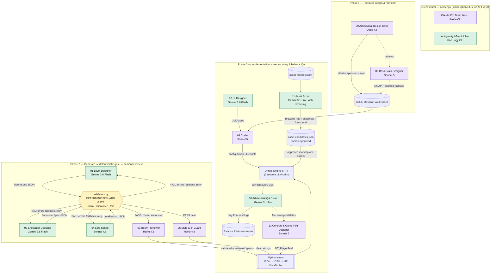

# Echoes — Development-Time Agent Crew

A multi-agent system that produces development-time content for **Echoes**, a
2.5D sci-fi metroidvania built in Unreal Engine 5.7.4. Twelve specialised agents
coordinate: a content crew drives a **generate → deterministically validate →
semantically review** pipeline whose artifacts import into the game as Unreal
DataTables, and one (the Asset Scout) sources marketplace art from the project's
asset manifest.

> ELVTR "Multi-Agent AI for Game Development" — Assignment #3 (Build an Agent Crew).

---

## What game is this for?

**Echoes.** One 15–25 minute map that plays as two different games depending on
the class chosen (agile *Hunter* vs. heavyweight *Titan*), ending in a single
boss fight against **La Costurera**. The design promise is *"asymmetry budgets
difficulty, never possibility"* — nothing is class-impossible, and the two
classes must stay provably fair.

## What the crew produces for it

All output is emitted as structured JSON, passed through a deterministic Python
gate, and imported into UE 5.7.4 as DataTables. **The shipped game makes zero
LLM calls** — runtime AI is classical GOAP and deterministic Blueprints; the
agents exist only at development time.

| Artifact | Produced by | Consumed in-engine as |
|---|---|---|
| Room geometry / gate / checkpoint specs | Level Designer | Level layout DataTables |
| Enemy encounter specs | Encounter Designer | Spawn DataTables |
| Bilingual EN/ES lore records | Lore Scribe | `ST_Lore` String Tables |
| Boss GOAP brain + scripted fallback | Boss-Brain Designer | GOAP/Blueprint tables |
| Player control scheme + game-feel parameters | Controls & Game-Feel Designer | `DT_PlayerFeel` DataTable |
| HUD / menu UMG specs | UI Designer | UMG widgets + `ST_UI` |
| Blueprint recipes + DataTable import scripts | Coder | Gameplay Blueprints |
| Per-class balance / fairness report | Adversarial QA Crew | Tuning decisions |
| Marketplace asset candidate shortlists | Asset Scout | Approved 3D / VFX / audio / UI assets |

Art is **marketplace / free assets only** (no original 3D art). The Asset Scout
sources candidates; a human approves each one and signs off its licence.

---

## Architecture



**Legend:** purple = Claude Pro Team lane (`claude` CLI); green = Antigravity /
Gemini Pro lane (`agy` CLI); amber = deterministic Python gate (no model).

---

## How it works

1. **Two subscription lanes, no API keys.** The orchestrator (`runner.py`) shells
   out to two official headless CLIs, each authenticated against a different
   subscription: `claude` (Claude Pro Team) and `agy` (Antigravity / Gemini Pro).
   No SDKs and no per-token API keys are used. Each agent is routed to its lane
   automatically. The `agy` lane also provides live web browsing, which the Asset
   Scout uses to source marketplace art; the `claude` lane has no web access.
2. **Minimal context.** Each agent declares a `## Required Vault Context` section
   listing only the design notes it needs; the orchestrator auto-injects those
   notes and nothing else. Canonical data (banned terms, enemy roster, budgets)
   is read from the vault as the single source of truth — never hard-coded in a
   prompt, so it cannot drift.
3. **Generate → validate → judge.** Generator output is checked by
   `validators.py`, a deterministic Python gate. On failure the exact errors are
   fed back to the generator and it retries; only validated content is forwarded
   to the LLM reviewer, which adds the *semantic* judgment a rule engine cannot
   (unintended exploits, dead space, disguised IP). Nothing invalid can reach the
   engine.

---

## The crew — roles, I/O, and why each is load-bearing

| # | Agent | Input | Output | Lane · Model | Gate / Reviewer |
|---|---|---|---|---|---|
| 01 | [Level Designer](01-level-designer.md) | Room brief + world/gate notes | `RoomSpec` JSON | Gemini · `gemini-3.6-flash` | validate:room → 03 |
| 02 | [Encounter Designer](02-encounter-designer.md) | Room + enemy palette notes | `EncounterSpec` JSON | Gemini · `gemini-3.6-flash` | validate:encounter → 03 |
| 03 | [Room Reviewer](03-room-reviewer.md) | Validated room/encounter JSON | Semantic `ReviewReport` JSON | Claude · `claude-haiku-4-5` | — (semantic layer) |
| 04 | [Lore Scribe](04-lore-scribe.md) | Lore node brief + lore bible | Bilingual `LoreRecord` JSON | Gemini(Antigravity) · `claude-sonnet-4-6` | validate:text → 05 |
| 05 | [Style & IP Guard](05-style-ip-guard.md) | Text record | `AuditReport` JSON | Claude · `claude-haiku-4-5` | — (semantic layer) |
| 06 | [Boss-Brain Designer](06-boss-brain-designer.md) | Boss design + blackboard spec | `GOAPBrain` JSON (+ scripted fallback) | Claude · `claude-sonnet-5` | 09 |
| 07 | [UI Designer](07-ui-designer.md) | Screen brief + HUD notes | `UMGSpec` JSON | Gemini · `gemini-3.6-flash` | 08 |
| 08 | [Coder](08-coder.md) | Approved design spec | Blueprint recipes + import scripts | Claude · `claude-sonnet-5` | build/test harness |
| 09 | [Adversarial Design Critic](09-adversarial-design-critic.md) | A design spec under review | Markdown risk/exploit report | Claude · `claude-opus-4-8` | human lead |
| 10 | [Adversarial QA Crew](10-adversarial-qa-crew.md) | Raw headless-bot telemetry | Balance report JSON | Gemini · `gemini-3.1-pro` | balance contract |
| 11 | [Asset Scout](11-asset-scout.md) | Asset-manifest entry + constraints | Ranked candidate shortlist JSON | Gemini · `gemini-3.1-pro` (web) | human approval |
| 12 | [Controls & Game-Feel Designer](12-controls-game-feel-designer.md) | Control scheme + feel notes | `DT_PlayerFeel` parameters — JSON → DataTable | Claude · `claude-sonnet-5` | QA Crew (feel sweep) |

**No agent is removable without breaking a pipeline.** Each owns exactly one
stage: drop **01/02/04** and the corresponding artifact (rooms, encounters,
lore) is never produced; drop **`validators.py`** and malformed or over-budget
content reaches the engine; drop **03/05** and exploits or disguised-IP text ship
unreviewed; drop **06** and the boss has no brain; drop **07/08** and there is no
UI or no config-driven implementation; drop **09** and design flaws are found
only after build time is spent; drop **10** and class fairness is never measured;
drop **11** and every marketplace asset must be sourced and licence-checked by
hand; drop **12** and the "movement is the reward" pillar has no owner — the
control scheme and feel parameters fall back to ad-hoc values in the Coder's tasks.

---

## Running it

Requires the two CLIs authenticated against their subscriptions (`claude` and
`agy`), and is run from the repository root.

```bash
# List the roster, lanes and models
python3 agents/runner.py --list

# Run a single agent (auto-injects its minimal vault context)
python3 agents/runner.py --agent 04 --input "Write one Mural fragment for Room_SeqA_02"

# Run a full generate → validate → judge pipeline (retries on validation failure)
python3 agents/runner.py --pipeline --agent 02 \
  --input "Design a corridor encounter for Room_SeqA_03" --output enc_SeqA_03.json

# Chain THREE LLM agents in one run: Level Designer → Encounter Designer → Room Reviewer
python3 agents/runner.py --pipeline-room \
  --input "Produce a Segment A combat room (Room_SeqA_04)" --output SeqA_04

# Validate a spec directly with the deterministic gate
python3 agents/validators.py --kind encounter --file production/output/enc_SeqA_03.json

# Source marketplace assets for the manifest (web browsing on the agy lane)
python3 agents/runner.py --scout --phase R3 --priority P0
```

Pipeline mappings: `01 → validate:room → 03`, `02 → validate:encounter → 03`,
`04 → validate:text → 05`. The room-production chain (`--pipeline-room`) runs
three LLM agents in a single pass — `01 Level → validate:room → 02 Encounter →
validate:encounter → 03 Reviewer` — handing each validated artifact to the next.

> **Reproducibility note.** The crew consumes two personal subscriptions through
> locally-authenticated CLIs, so a fresh clone cannot execute it without those
> accounts. Sample validated outputs and a per-call token log are committed under
> `production/output/` as evidence of a working run.

---

## Repository layout

```
agents/
  runner.py            Orchestrator — routes agents to subscription CLIs, runs the pipeline and the scout
  validators.py        Deterministic hard gate (room / encounter / text)
  NN-*.md              The 12 agent specs (role, model, required vault context, system prompt)
  README.md            This file
vault/                 Obsidian design notes — single source of truth injected as context
production/
  asset-manifest.json  The assets the slice needs (Asset Scout input)
  output/              Validated artifacts, asset-candidates.json, usage_log.jsonl (proof of run)
```
