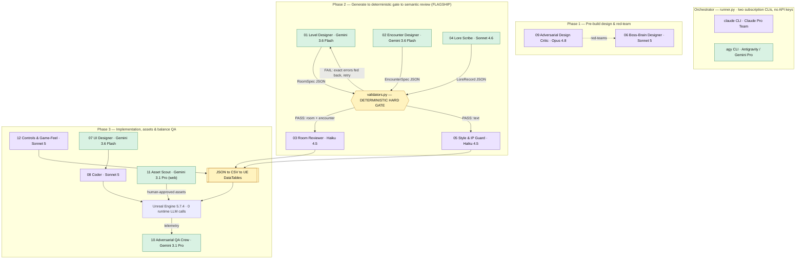

# Echoes — Development-Time Agent Crew

**ELVTR "Multi-Agent AI for Game Development" — Assignment #3 (Build an Agent Crew).**

A twelve-agent system that produces **development-time** content for **Echoes**, a
2.5D sci-fi metroidvania in Unreal Engine 5.7.4. The crew runs a
**generate → deterministically validate → semantically review** pipeline whose JSON
artifacts import into the game as Unreal **DataTables**.

> **The shipped game makes zero runtime LLM calls.** Runtime AI is classical GOAP +
> deterministic Blueprints; the agents exist only at development time.

---

## Where the graded evidence lives (read this first)

All **twelve** agents are fully specified in [`agents/`](agents/) and routed to their
model lane by the orchestrator. To keep the submission focused and reproducible, the
**runnable evidence is concentrated on one flagship pipeline — the three-agent
room-production trio:**

> **01 Level Designer → (gate) → 02 Encounter Designer → (gate) → 03 Room Reviewer**

That run is committed under [`production/output/`](production/output/):

- `SeqA_06_room.json`, `SeqA_06_encounter.json` — the validated artifacts
- `usage_log.jsonl` — per-call model + token/cost log (proof the three agents really ran)

Run it yourself with `python3 agents/runner.py --pipeline-room`. The other nine agents
are specified, lane-routed, and part of the architecture below, but their outputs are
not the focus of this submission.

---

## Two model lanes — how agents connect to different models

The orchestrator (`runner.py`) shells out to **two official subscription CLIs — no API
keys, no per-token billing.** Each agent is auto-routed to its lane:

| Lane | CLI | Subscription | Live web | Role |
|---|---|---|---|---|
| **Claude** | `claude` | Claude Pro Team | no | reasoning / review / coding-heavy agents |
| **Gemini** | `agy` | Antigravity / Gemini Pro | **yes** | fast structured bulk generation + web sourcing |

A third "lane" is **not a model at all**: `validators.py`, a deterministic Python gate.
It enforces the countable rules (room/enemy budgets, checkpoint spacing, cross-class gate
contamination, banned terms, string overflow) *before* anything reaches an LLM reviewer or
the engine — so a language model is **never trusted for arithmetic**.

---

## Architecture — how the agents connect to each other



**Pipeline shape (generate → validate → judge).** A generator emits JSON → the
deterministic gate validates it and, on failure, **feeds the exact errors back to the
generator to retry** → only validated content reaches the LLM reviewer, which adds the
*semantic* judgment a rule engine cannot (unintended exploits, dead space, disguised IP,
tone drift). Nothing invalid can reach the engine. Wired chains in `runner.py`:

- `01 → validate:room → 03`
- `02 → validate:encounter → 03`
- **`01 → validate:room → 02 → validate:encounter → 03`** ← the flagship room-production chain
- `04 → validate:text → 05`

---

## The crew — all twelve agents

Each agent owns exactly one stage; **none can be removed without breaking a pipeline.**
For each: *what it does · input → output · model (lane) · why that model.*

### Phase 1 — Pre-build design & red-team
- **09 · Adversarial Design Critic** — red-teams feature specs, rooms and boss mechanics
  *on paper* before anything is built, hunting unwinnable states, trivial exploits and
  logical contradictions. *A spec under review → Markdown risk/exploit report.*
  **Claude Opus 4.8 (Claude lane)** — adversarial red-teaming rewards the deepest reasoning
  to surface subtle edge cases before build time is spent.
- **06 · Boss-Brain Designer** — formulates the GOAP state spaces, goal-utility formulas,
  action preconditions/effects and blackboard rules for La Costurera and her two revived
  Knights, plus a scripted-pattern fallback the slice can ship without GOAP.
  *Boss design + blackboard spec → `GOAPBrain` JSON.* **Claude Sonnet 5 (Claude lane)** —
  multi-agent GOAP state spaces and utility formulas need systems-level, formal-state reasoning.

### Phase 2 — Generate → deterministic gate → semantic review  *(the flagship trio lives here)*
- **01 · Level Designer** ⭐ — proposes room layouts, platforms, gates, checkpoints and
  camera bounds. *Room brief + world/gate notes → `RoomSpec` JSON.*
  **Gemini 3.6 Flash (Gemini lane)** — emitting numeric coordinate arrays and rigid JSON
  geometry is a fast, structured task; schema conformance is enforced downstream by the
  deterministic validator, so bulk level output stays off the Claude subscription.
- **02 · Encounter Designer** ⭐ — places enemy combinations from the closed archetype
  palette within per-room budgets to test both classes asymmetrically. *Room + enemy-palette
  notes → `EncounterSpec` JSON.* **Gemini 3.6 Flash (Gemini lane)** — placing spawns against
  budgets is a fast, data-driven task; kept off the Claude subscription.
- **03 · Room Reviewer** ⭐ — the *semantic* second layer over the validator: design-intent,
  unintended exploits, asymmetry health, and reachability caveats it flags for in-engine QA
  rather than asserting. *Validated room + encounter JSON → `ReviewReport` JSON.*
  **Claude Haiku 4.5 (Claude lane)** — fast, disciplined rule-following for a bounded review
  pass without prompt drift.
- **04 · Lore Scribe** — a RAG agent writing bilingual EN/ES environmental lore, murals and
  terminal logs aligned to the cosmology bible. *Lore brief + lore bible → `LoreRecord` JSON.*
  **Claude Sonnet 4.6 (Antigravity/Gemini lane)** — bilingual lore with equivalent poetic
  weight (not linear translation) needs Sonnet-tier prose sensibility.
- **05 · Style & IP Guard** — the *semantic* compliance layer over the deterministic
  term/length check: tone drift and disguised-IP a regex cannot catch. *Text record →
  `AuditReport` JSON.* **Claude Haiku 4.5 (Claude lane)** — fast, disciplined tone/semantic
  auditing without prompt drift.

### Phase 3 — Implementation, asset sourcing & balance QA
- **07 · UI Designer** — lays out HUD, menus, class-selection and run-summary screens as
  UMG specs wired to EN/ES String Tables. *Screen brief + HUD notes → `UMGSpec` JSON.*
  **Gemini 3.6 Flash (Gemini lane)** — mapping UMG widget properties to a data layout is
  fast and structured; kept off the Claude subscription.
- **08 · Coder** — translates approved specs into modular, config-driven Blueprints and
  Python DataTable importers (every tunable read from a DataTable). *Approved spec →
  Blueprint recipes + import scripts.* **Claude Sonnet 5 (Claude lane)** — editor-automation
  Python and precise Blueprint node logic demand top coding accuracy and correct UE API usage.
- **12 · Controls & Game-Feel Designer** — owns the verb→button scheme (Enhanced Input) and
  the game-feel tunables that make "movement is the reward" tactile. *Control scheme + feel
  notes → `DT_PlayerFeel` rows → CSV → DataTable.* **Claude Sonnet 5 (Claude lane)** — feel
  tuning (coyote time, i-frame windows, cancel priority, jump arcs) is judgment-heavy systems
  design where small numbers change how the whole game feels.
- **10 · Adversarial QA Crew** — analyzes telemetry from the headless bot-playtest harness
  and checks the build against the balance contract; it does **not** run the bots or invent
  telemetry. *Raw telemetry logs → balance report JSON.* **Gemini 3.1 Pro (Gemini lane)** —
  a large context window to ingest bulk logs and summarize them, off the Claude subscription.
- **11 · Asset Scout** — researches real marketplace/free assets for one manifest entry and
  returns ranked candidates for human licence sign-off. *Manifest entry + constraints →
  `AssetCandidateList` JSON.* **Gemini 3.1 Pro, web (Gemini lane)** — the only agent that
  needs live browsing; the `agy` lane has working headless web access (the `claude` lane does
  not), and Pro adds the judgment to read licences and assess IP safety.

---

## Model-choice philosophy (why the mix)

The routing is deliberate, not incidental — cost, capability and web access are matched to
each task, and correctness is never left to the model where a rule can decide it:

- **Gemini 3.6 Flash** → fast, high-volume, *structured* JSON (levels, encounters, UI).
  A deterministic gate guarantees correctness downstream, so the cheapest fast model is
  enough and bulk generation stays off the Claude subscription.
- **Claude Haiku 4.5** → bounded, disciplined *semantic review* (Room Reviewer, Style Guard)
  — cheap and drift-resistant for a rule-following pass.
- **Claude Sonnet 5 / 4.6** → *judgment-heavy* systems, code and prose (Boss-Brain, Coder,
  Game-Feel, bilingual Lore).
- **Claude Opus 4.8** → the *deepest adversarial reasoning* (pre-build Design Critic).
- **Gemini 3.1 Pro** → *large-context* telemetry analysis and *live web browsing* (QA Crew,
  Asset Scout).
- **`validators.py` (no model)** → every countable rule, so no LLM is trusted for arithmetic.

---

## Running it

Requires the two CLIs authenticated against their subscriptions (`claude`, `agy`), run from
this folder.

```bash
python3 agents/runner.py --list                        # roster, lanes and models
python3 agents/runner.py --pipeline --agent 01 \        # one agent: generate to validate to review
  --input "Design a Segment A shared traversal room"
python3 agents/runner.py --pipeline-room \              # the flagship 3-agent chain
  --input "Produce a Segment A combat room" --output SeqA_07
python3 agents/validators.py --kind room --file production/output/SeqA_06_room.json
```

---

## Reproducibility

The crew consumes two personal subscriptions through locally-authenticated CLIs, so a fresh
clone cannot execute it without those accounts. The committed `production/output/` artifacts
and `usage_log.jsonl` are the evidence of a working run — headlined by the three-agent
`SeqA_06` flagship.

---

## Repository layout

```
assignment-03-agent-crew/
  README.md              This document
  agents/
    NN-*.md              The 12 agent specs (role, model, required vault context, system prompt)
    runner.py            Orchestrator — routes each agent to its subscription CLI; runs the pipelines
    validators.py        Deterministic hard gate (room / encounter / text)
  vault/                 Design notes — the single source of truth injected as agent context
  production/
    asset-manifest.json  Assets the slice needs (Asset Scout input)
    output/              Validated artifacts + usage_log.jsonl (proof of run); SeqA_06 = flagship
```
